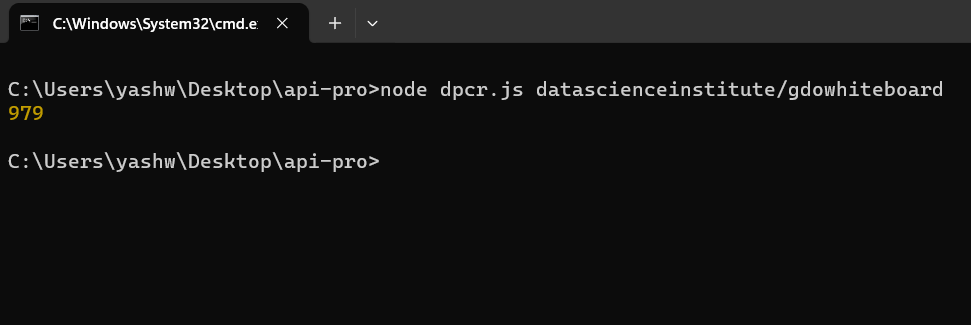

# live-pulls-count-for-Docker-repositories

live pulls count for Docker repositories using js

# Couldn't find it on Google, so I created it

A Node.js script to retrieve the pull count for a Docker repository from Docker Hub.

## Prerequisites

Make sure you have Node.js and npm installed on your machine.

- [Node.js](https://nodejs.org/)
- [npm](https://www.npmjs.com/)

## Installation

1. Clone the repository:

git clone https://github.com/your-username/docker-hub-pull-counter.git

2.Navigate to the project directory:

cd docker-hub-pull-counter

3.Install dependencies:

npm install

# Usage

Run the script with the name of the Docker repository as a command line argument:

node dprc.js <repository-name>

Replace <repository-name> with the name of the Docker repository you want to check.

# Example:

https://hub.docker.com/r/datascienceinstitute/gdowhiteboard

these is repo url means copy 

datascienceinstitute/gdowhiteboard and paste after node dprc.js

node dprc.js datascienceinstitute/gdowhiteboard

𝙏𝙝𝙞𝙨 𝙞𝙣𝙛𝙤𝙧𝙢𝙖𝙩𝙞𝙤𝙣 𝙞𝙨 𝙤𝙣𝙡𝙮 𝙛𝙤𝙧 𝙚𝙙𝙪𝙘𝙖𝙩𝙞𝙤𝙣al 𝙥𝙪𝙧𝙥𝙤𝙨𝙚 𝙖𝙣𝙙 𝙬𝙚 𝙖𝙧𝙚 𝙣𝙤𝙩 𝙧𝙚𝙨𝙥𝙤𝙣𝙨𝙞𝙗𝙡𝙚 𝙛𝙤𝙧 𝙖𝙣𝙮 𝙠𝙞𝙣𝙙 𝙤𝙛 𝙞𝙡𝙡𝙚𝙜𝙖𝙡 𝙖𝙘𝙩𝙞𝙫𝙞𝙩𝙮 𝙙𝙤𝙣𝙚 𝙗𝙮 𝙩𝙝𝙞𝙨 𝙩𝙤𝙤𝙡.

  

